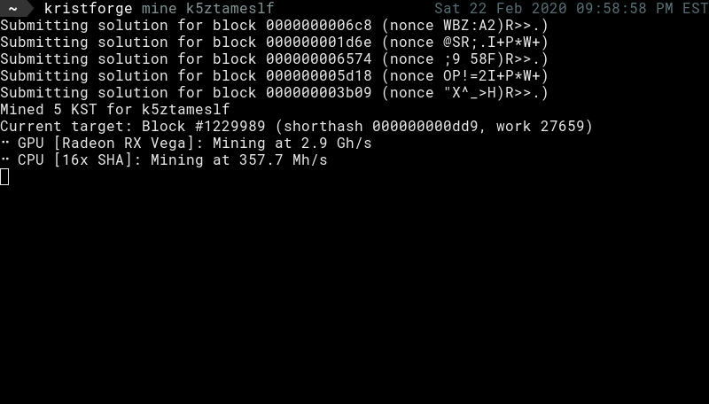

# tenebraforge 

Tenebraforge is a cross-platform hardware accelerated GPU and CPU [tenebra](https://tenebra.ceriat.net) miner. Tenebraforge uses
OpenCL and accelerated CPU instruction sets to maximize performance, making it the fastest tenebra miner in existence.

## Download

Pre-built 64-bit binaries for Linux and Windows can be found on the
[release page](https://github.com/tmpim/tenebraforge/releases).

## Usage

Tenebraforge supports both CPU and GPU mining. GPU mining is usually faster and more efficient, but modern CPUs can also
provide decent speeds.

OpenCL drivers are required for GPU support to work - these are usually included with your
graphics drivers, but you may need to manually install them. See your manufacturer's driver/support page for
instructions for your specific setup. On Linux systems in particular, these are often packaged separately from graphics
drivers, and should be installed through your distribution's package manager.

Tenebraforge provides many command-line options to configure it to suit your needs, but also intelligently selects 
defaults that provide near-optimal performance for most users. The default behavior of tenebraforge is to use all GPU
devices and automatically scale up batch sizes, and use as many CPU miner threads as your system has logical cores.

## Examples 

- Mine with default settings using both CPU and GPU
    - `tenebraforge mine <address>`
- Mine with default settings using only GPU
    - `tenebraforge mine <address> --no-cpu`
- Mine with only CPU with a specific number of threads
    - `tenebraforge mine <address> --no-gpu --cpu-threads 8`
- Get mining hardware information
    - `tenebraforge info`

Complete usage information for more advanced configuration can be viewed with `tenebraforge help [subcommand]`.
